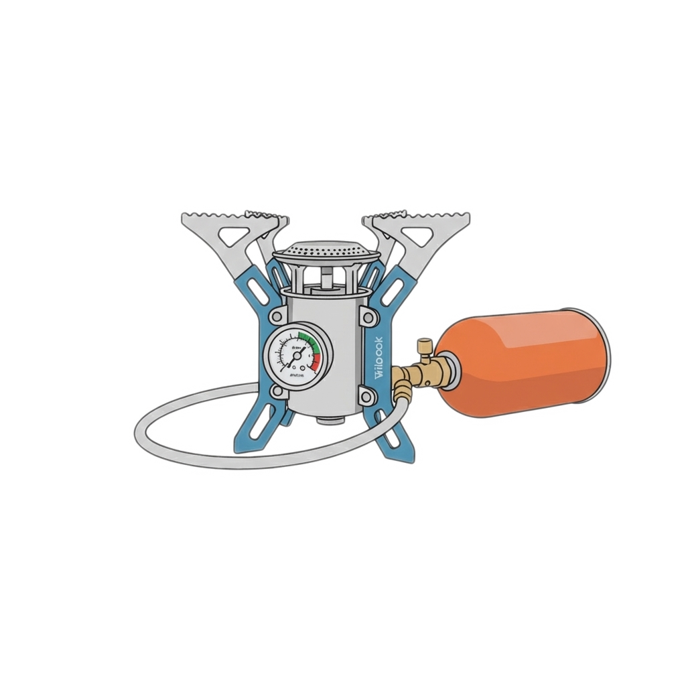

# Gas Gauge

A simple self hosted web application to track remaining gas in canisters for camp stoves.

## Features

- **Dashboard**: View all active canisters with remaining gas percentages
- **Show Depleted Toggle**: Hide/show depleted canisters with client-side toggle
- **Weighing History**: Track multiple weighings per canister over time
- **Visual Analytics**: Pie charts showing gas consumption breakdown by trip
- **CheatSheets**: Generate printable reference tables showing weight-to-percentage mappings for field use
- **Archive**: Soft delete with "depleted" status preserves history
- **Hard Delete**: Optional cascade deletion of canisters and all weighing records
- **Custom Types**: Add your own canister types
- **Protected Types**: Built-in types (Coleman 240g) cannot be deleted
- **UUID-based IDs**: Unique canister identifiers combining UUID + timestamp
- **Color-coded Status**: Quick visual identification of canister levels
  - Green: >50% remaining
  - Yellow: 25-50% remaining
  - Red: <25% remaining
  - Purple: Depleted
  - Gray: No measurements yet

## Quick Start

### Using Docker (Recommended)

The easiest way to deploy is using the provided deploy script:

1. **Deploy (first time or updates):**
   ```bash
   ./create-container-gasgauge.sh
   ```

   This script will:
   - Stop and remove existing container (if any)
   - Remove old image
   - Build fresh image
   - Create container with data persistence
   - Database persists in `~/code/container_data`

### Local Setup (without Docker)

1. **Install dependencies:**
   ```bash
   pip install -r requirements.txt
   ```

2. **Run the app:**
   ```bash
   uvicorn main:app --host 0.0.0.0 --port 8003 --log-config uvicorn_log_config.ini
   ```

## Data Persistence

- **Database location**: `~/code/container_data/gas_gauge.db` (both Docker and local development)
- Automatically created on first run with directory creation
- Survives container restarts and rebuilds
- Seed data added automatically if database is new (Coleman 240g canister type)
- Can be overridden with `DATABASE_PATH` environment variable

## Logging

- Logs are written to **both stdout and file**
- Log format: `YYYY-MM-DD HH:MM:SS - LEVEL - MESSAGE`
- Includes uvicorn, access, and application logs
- **File location**: `~/code/container_data/logs/gas_gauge.log` (persisted on host)
- **Log rotation**: Application-level RotatingFileHandler (max 3 files × 10KB each)

To view logs:
```bash
# Docker logs (stdout)
docker logs gas-gauge
docker logs -f gas-gauge  # Follow in real-time

# Log file (persisted)
tail -f ~/code/container_data/logs/gas_gauge.log
cat ~/code/container_data/logs/gas_gauge.log

# Backup log files (rotated)
ls -lh ~/code/container_data/logs/
```

For local development, logs appear in both the console and `~/code/container_data/logs/gas_gauge.log`.

## Backup

Use the provided backup script:
```bash
./backup_db.sh
```

Or manually backup your data:
```bash
cp ~/code/container_data/gas_gauge.db ~/backup/gas_gauge_$(date +%Y%m%d).db
```

To restore from backup:
```bash
docker stop gas-gauge
cp ~/backup/gas_gauge_20250115.db ~/code/container_data/gas_gauge.db
docker start gas-gauge
```

## Useful Docker Commands

```bash
# View logs
docker logs gas-gauge
docker logs -f gas-gauge  # Follow in real-time

# Stop the container
docker stop gas-gauge

# Start the container
docker start gas-gauge

# Restart the container
docker restart gas-gauge

# Remove the container (data persists in ~/code/container_data)
docker rm gas-gauge
```

### Project Structure

```
gas-gauge/
├── main.py                         # FastAPI app with all routes (13 endpoints)
├── business_logic.py               # Business calculations and orchestration
├── database_manager.py             # All database CRUD operations
├── database_model.py               # Peewee ORM models (3 tables)
├── utils.py                        # Utility functions (UUID generation)
├── seed_data.py                    # Seed predefined canister types
├── templates/                      # Jinja2 templates
│   ├── base.html                   # Base template with navbar
│   ├── dashboard.html              # Main dashboard
│   ├── canister_detail.html        # Individual canister view
│   └── types.html                  # Canister types management
├── static/                         # Static assets
│   ├── css/custom.css              # Custom styling
│   ├── js/app.js                   # JavaScript utilities
│   ├── gas_gauge.png               # Logo (1024x1024)
│   └── favicon.ico                 # Browser favicon
├── data/                           # SQLite database (created at runtime)
├── Dockerfile                      # Docker image definition
├── create-container-gasgauge.sh    # Main deployment script
├── create-container-gasgauge.sh    # Deployment wrapper
├── backup_db.sh                    # Database backup script
├── uvicorn_log_config.ini          # Logging configuration
└── requirements.txt                # Python dependencies
```

## Usage Guide

### Adding a Canister

1. Click "Add New Canister" on the dashboard
2. Enter a label (e.g., "Gas Canister A")
3. Select canister type
4. Click "Add Canister"

### Recording a Weighing

1. Click on a canister card
2. Click "Add Weighing"
3. Enter weight in grams
4. Optionally add a comment about the trip
5. Click "Add Weighing"

### Marking as Depleted

1. Go to canister detail page
2. Click "Mark as Depleted"
3. Canister moves to archive but retains all history

### Adding Custom Canister Types

1. Navigate to "Canister Types" in the menu
2. Click "Add New Type"
3. Enter name, full weight, and empty weight
4. Gas capacity is calculated automatically

## Tech Stack

- **Backend:** FastAPI, Peewee ORM, SQLite
- **Frontend:** Bootstrap 5, Chart.js, TomSelect, Vanilla JavaScript
- **Templates:** Jinja2
- **Deployment:** Docker

## License

MIT License - feel free to clone and run your own instance!
